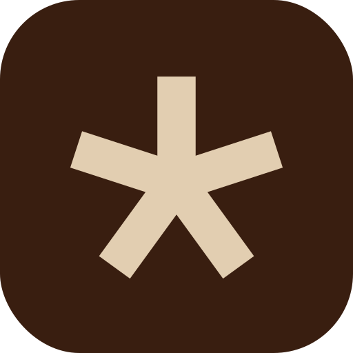

### Nudge AI SDK

**Nudge** gives your product a voice a little word, a world of possibility. 

---

Bring wake-word detection to your app with **`@nudgeai/sdk`**. Feed audio from
your app in Node.js or Bun and detect wake words locally with the built-in
Alexa, Hey Google, and Hey Siri models. Signed `.nudge` models verify offline.
Your application owns microphone capture and permissions.

### Get started

[Install the SDK and detect wake words →](./docs/getting-started.md)

### Documentation

- [Audio](./docs/audio.md) — application PCM and local audio files.
- [API reference](./docs/api.md) — options, events, and PCM input.
- [Models](./docs/models.md) — built-in models and signed `.nudge` files.
- [Browser](./docs/browser.md) — browser integration.

[All documentation →](./docs/README.md)

### License

Personal, noncommercial use of the SDK and its three bundled example models
is allowed. Company and commercial use require
a separate paid license: [commercial@nudgeai.llc](mailto:commercial@nudgeai.llc).
Training and additional model access are separate offerings.

[License](./LICENSE) · [Licensing details](./docs/licensing.md)
